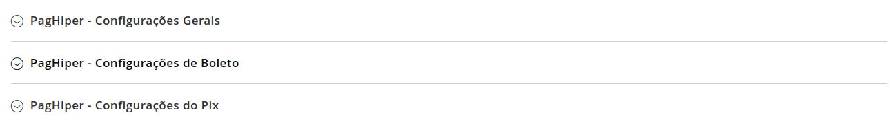
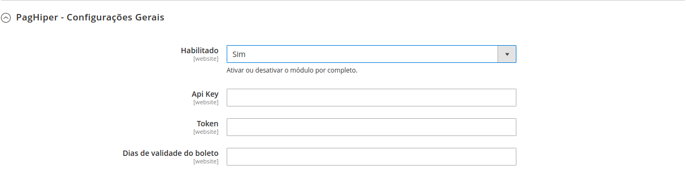
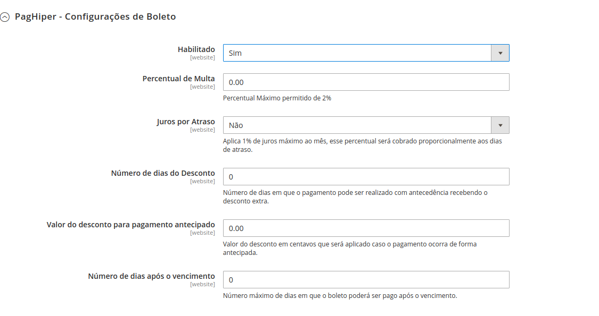

# Módulo de integração [PagHiper](https://www.paghiper.com/) 

## Instalação

> Recomendamos que você possua um ambiente de testes para validar as alterações e atualizações antes de atualiar sua loja em produção. Também, que seja feito um **backup** com todas as informações antes de executar qualquer procedimento de atualização/instalação.

### Versões Compativeis:

- [x] 2.3.X
- [x] 2.4.0
- [x] 2.4.1
 
### Pré requisito:

- Requer que o PHP esteja no mínimo na versão 7.0.X.

### Instalação do Módulo de Integração do PagHiper:

- Realize o download do módulo e siga os seguintes passos de acordo com a forma que sua loja foi instalada:

  #### [Modulo-PagHiper](https://github.com/paghiper/Modulo-PagHiper-Pix-Magento-2.3.X-e-2.4.X)

### Instalar usando o Composer

1. Instale via packagist 
   - ```composer require paghiper/module-magento2```
       - Neste momento, podem ser solicitadas suas credenciais de autenticação do Magento. Caso tenha alguma dúvida, há uma descrição de como proceder neste [link da documentação oficial](http://devdocs.magento.com/guides/v2.0/install-gde/prereq/connect-auth.html).
2. Execute os comandos:
   - ```bin/magento setup:upgrade```
   - ```bin/magento setup:di:compile```
   - ```bin/magento setup:static-content:deploy -f```
   

   ### Instalar usando o github

- Caso sua loja tenha sido criada por meio do clone ou download do projeto magento, siga os seguintes passos:

  1. Baixe o repositório em um arquivo .zip;
  2. Dentro do diretório de instalação da loja, crie a estrutura de pastas ```app/code/Paghiper/Magento2```
  3. Extraia o conteúdo do arquivo zip dentro dessa pasta.
  4. Habilite o módulo com o seguinte comando, ```bin/magento module:enable Paghiper_Magento2```
  5. Execute o comando ```bin/magento setup:upgrade```
  6. Execute o comando ```bin/magento setup:di:compile```
  7. Execute o comando ```bin/magento setup:static-content:deploy -f```
  8. Execute o comando ```bin/magento cache:clean```


### Configurações

Acesse no Painel Administrativo do Magento no menu lateral clique em `Lojas`, depois clique em `Configuração`, na sequencia clique em `Clientes`,  `Configurações de Cliente`, e acesse a opção `Opções de Nome e Endereço`. Em `Número de Linhas em Endereço` você deve informar o número 4, conforme imagem abaixo:


Após realizar a configuração do Cliente, acesse no Painel Administrativo do Magento No menu lateral clique em `Lojas`, na sequencia clique em `Configuração`, no sub-menu `Vendas` clique em `Formas de Pagamento`. Será carregada a tela para configurar os meios de pagamentos do site. 

<p align="center">
  
</p>

### Como habilitar o PagHiper na sua loja

No primeiro bloco de informação, está a configuração para habilitar ou desabilitar o módulo por completo, marque `Sim` para continuar a configuração. Em seguida possuimos os seguites campos:

- Api Key
 - Chave da Api fornecida pelo PagHiper.

- Token
  - Token Fornecido pelo PagHiper.

- Dias de Validade
  - Essa opção é utilizada tanto para boleto como para o pix. É utilizado um valor inteiro em dias para dizer a validade do boleto.

  

Logo abaixo, possui 2 opções, uma de configuração de pagamento com o Pix e outra com boleto.

OBS: Para que todas as configurações a seguir funcionem, todo o passo a passo anterior deve ter sido seguido.

### Configurações de Boleto

- Habilitado
 - Habilita ou desabilita a forma de pagamento por boleto.

- Percentual de Multa
 - Adiciona um valor ao percentual de multa por atraso.

- Juros por Atraso
    - Define se é aplicado ou não juros por atraso, valor.

- Número de dias do Desconto
    - Número de dias antes que será permitido o desconto com o valor informado.

- Valor do desconto para pagamento antecipado
    - Valor do desconto que será concedido ao boleto.

- Número de dias após o vencimento
    - Número de dias que o cliente pode ainda pagar o boleto após o vencimento.



### Configurações do Pix

- Habilitado
 - Habilita ou desabilita o método de pagamento com Pix.


